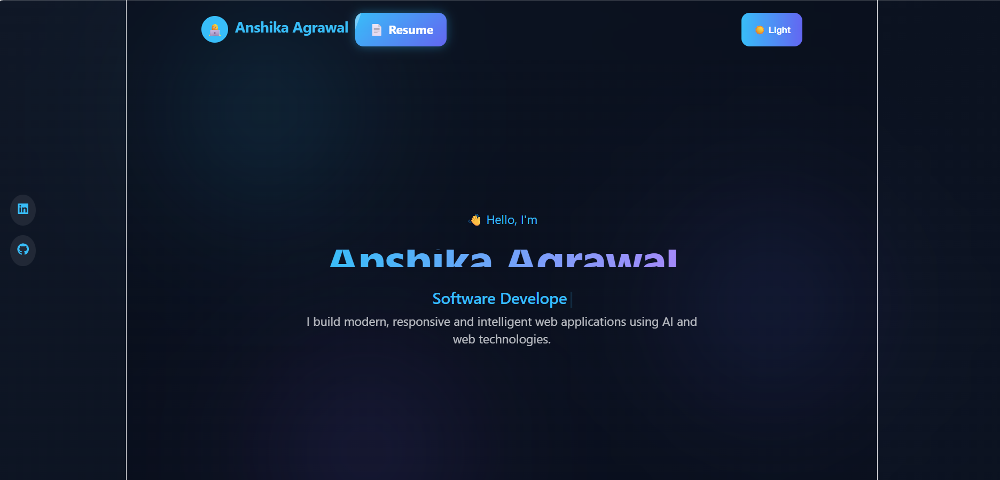
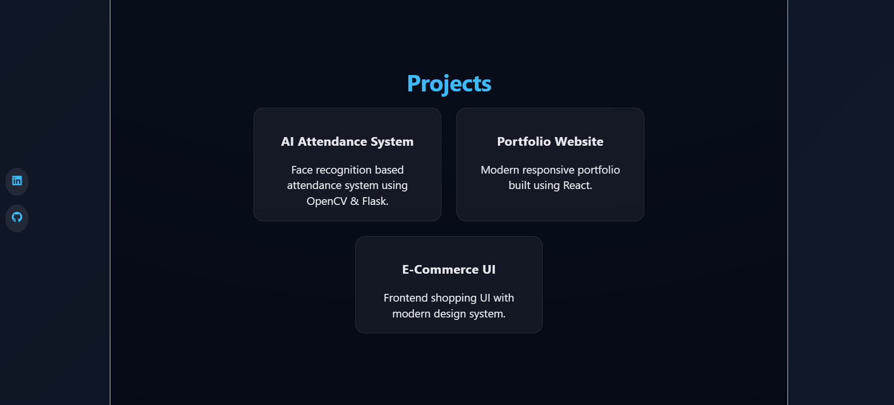
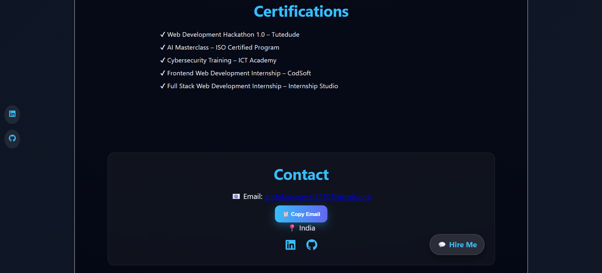

# 🌐 Personal Portfolio

A modern, responsive, and interactive personal portfolio website built with **React** and **Vite** to showcase my professional profile, technical skills, projects, certifications, and resume.

## ✨ Features

* 🌙 Dark & Light Theme Toggle
* ⚡ Responsive and Modern UI
* ⌨️ Animated Typewriter Effect
* 📂 Project Showcase
* 🏆 Certifications Section
* 📄 Resume Download
* 📧 One-Click Email Copy
* 💼 LinkedIn & GitHub Integration
* 💬 WhatsApp "Hire Me" Button
* 🎨 Clean & Professional User Interface

## 🛠️ Tech Stack

* React.js
* Vite
* JavaScript (ES6+)
* HTML5
* CSS3
* React Icons
* React Simple Typewriter

## 📸 Portfolio Sections

<h3>🏠 Home</h3>
<p align="center">
  
</p>

<h3>💻 Projects</h3>
<p align="center">
  
</p>

<h3>📬 Contact</h3>
<p align="center">
  
</p>

## 🚀 Getting Started

Clone the repository:

```bash
git clone https://github.com/anshika2410-hub/Personal_Portfolio.git
```

Navigate to the project folder:

```bash
cd Personal_Portfolio
```

Install dependencies:

```bash
npm install
```

Start the development server:

```bash
npm run dev
```

## 📄 Resume

A resume is available directly from the portfolio.


## 🌐 Live Demo

> Live URL: *https://anshika2410-hub.github.io/Personal_Portfolio/*


## 📬 Contact

**Anshika Agrawal**

* GitHub: https://github.com/anshika2410-hub
* LinkedIn: https://www.linkedin.com/in/contact-anshikaagrawal/
* Email: anshikaagrawal2410@gmail.com

## 🤝 Contributing

Contributions, suggestions, and feedback are welcome. Feel free to fork the repository, create a new branch, and submit a pull request.

## 📜 License

This project is available for educational and personal use.

---

⭐ If you found this project helpful, consider giving it a star on GitHub.
